%%todo: rubber band select for checklist, timeline, treelist, collection, graph, node graph - where rubber band select can be discontiguous, and have handles%%
%%todo: span for aformentioned, where a span is a selection that is persisted to the container%%

# Content
## Header

## Body Text

## Icon
Any pictograph. Can be inlined with text or labels, or occupy its own register
| sizes | affordances |
| ----- | ----------- |
| [inline](./Styles#inline), [small](./Styles#small)| none |

## Graphic
A visualization of data

### Bar
A rectangle, the length of which signifies a value, relative to other bars in a graph

### Gauge
A bar, curved into an arc. The length of the bar signifies a percentage.

### Line

### Donut

### Image

### Sunburst
%% sunburst is a kind of chart ... and it can have controls as well. shouldn't it be in containers? %%

### Video

## Label

| sizes | affordances |
| ----- | ----------- |
| [inline](./Styles#inline) |  |


A single line of text that:
* describes graphical [content](#Content)
* describes the type, category, or common attributes of [body text](#Body-Text)
* indicates the value of data within a [control](#Control)
* describes the content within a [container](#Container)
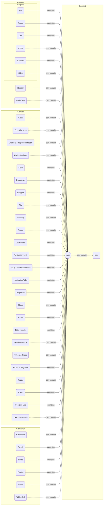

* Multiple labels can be applied to a graphic, body text, control or container.
	* There are several types of labels, each of which have a distinct appearance. The variation in appearance reinforces content hierarchy, especially when several labels are applied to the same component.
* Labels should never be applied to other labels.
* Labels are always inlined
### Annotation
| sizes | affordances |
| ----- | ----------- |
| [inline](./Styles#inline) |  |

a label that can be attached to the focus ring or border of any other component

### Badge
| sizes | affordances |
| ----- | ----------- |
| [inline](./Styles#inline) | [hoverable](./Affordances#hoverable), [peekable](./Affordances#peekable), [pressable](./Affordances#pressable) |
A short text, or text and icon, enclosed by a container, similar to a token. Unlike a token, a badge cannot be dragged or deleted.
* Single Segment
* Multi Segment

### Date
| sizes | affordances |
| ----- | ----------- |
| [inline](./Styles#inline) |  |
a date, which can include year, month and day

### DateTime
| sizes | affordances |
| ----- | ----------- |
| [inline](./Styles#inline) |  |
a date and a timestamp, combined into a single label
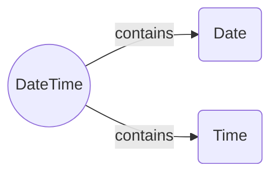

### Inline Indicator
| sizes | affordances |
| ----- | ----------- |
| [inline](./Styles#inline) |  |
a label that can be inlined within a field, and indicates special characteristics e.g. "required" or "warning"

### Time
| sizes | affordances |
| ----- | ----------- |
| [inline](./Styles#inline) |  |
a timestamp, which can be formatted as HH:MM, HH:MM:SS:Timezone, HH:MM:SS:MS:Timezone, or as a SMPTE frame-time

# Control

All controls effect a *change* in the application.

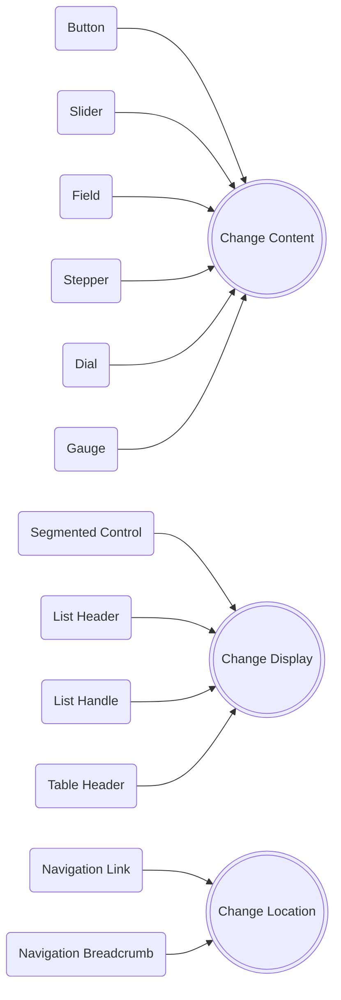


## Avatar
A control that can act as a button, a token, or both, depending on its location and nesting. It contains the profile picture of a user. It can also be combined with a single-segment or multi-segment badge to convey information about the user.
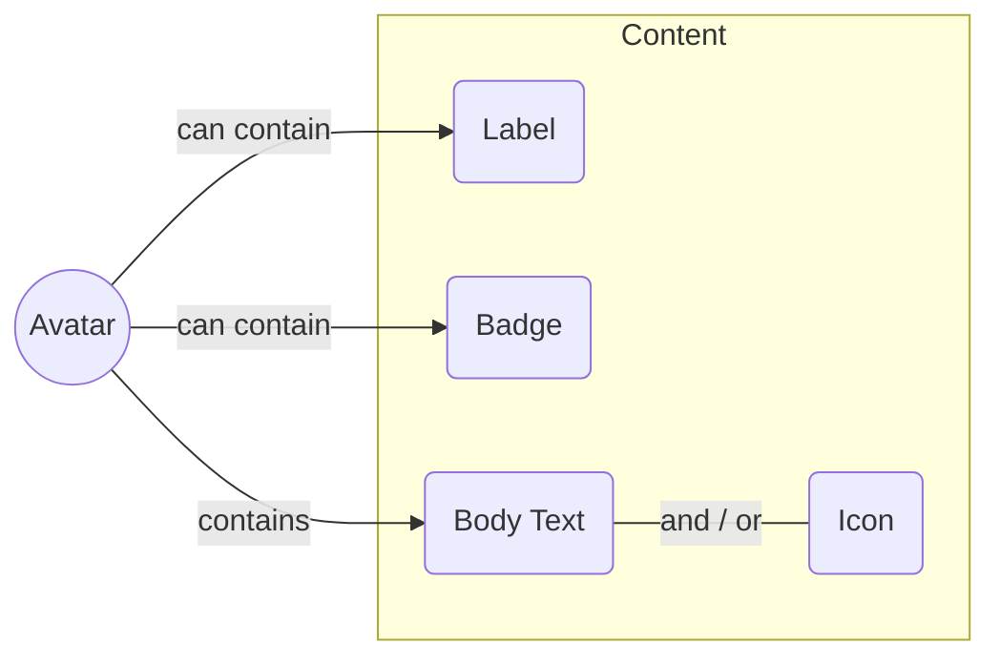
## Button

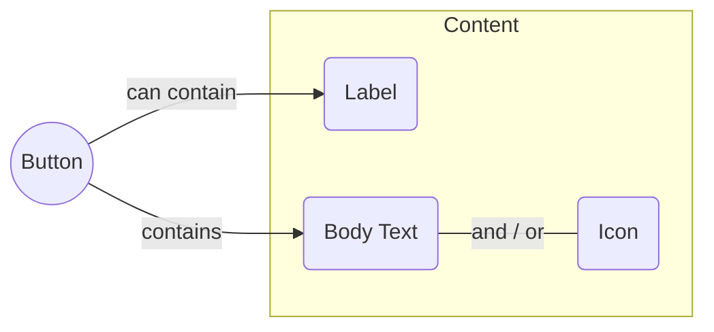
## Checklist Item
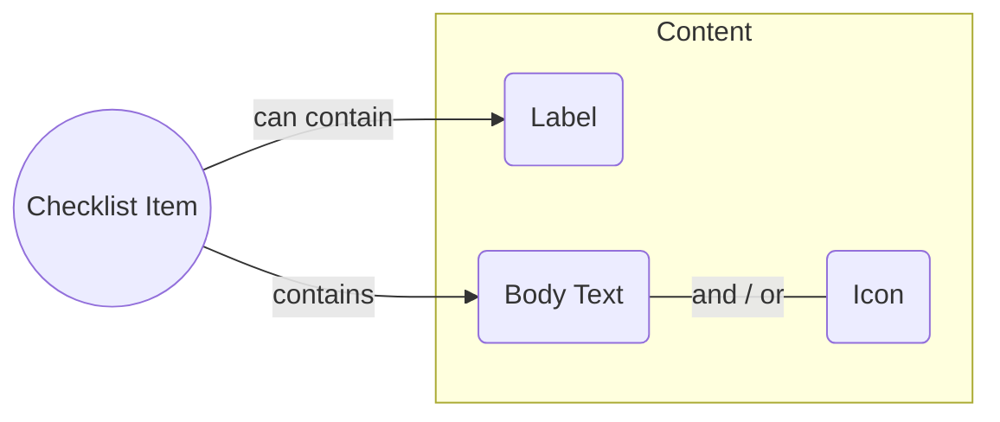
## Checklist Progress Indicator
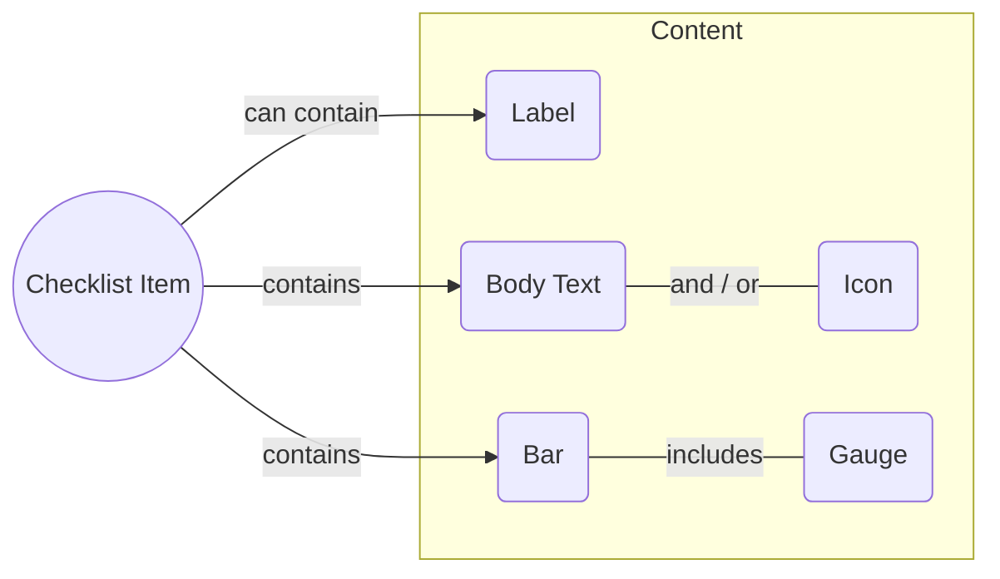
## Collection Item
a tile that wraps content, making it selectable and draggable within or among collections
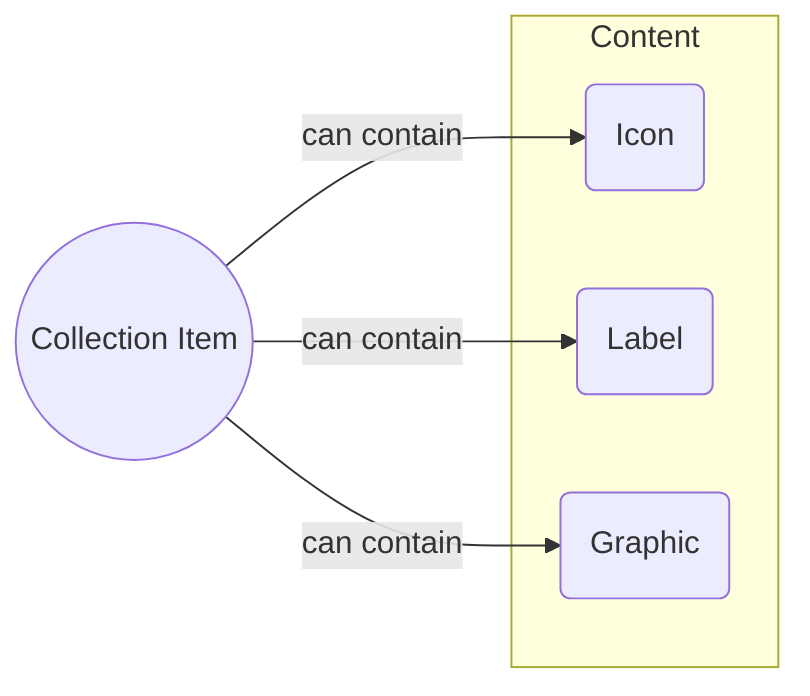
## Field

* single-segment
* multi-segment
	* *a multi-segment field groups two or more single segment fields together*
* multiline
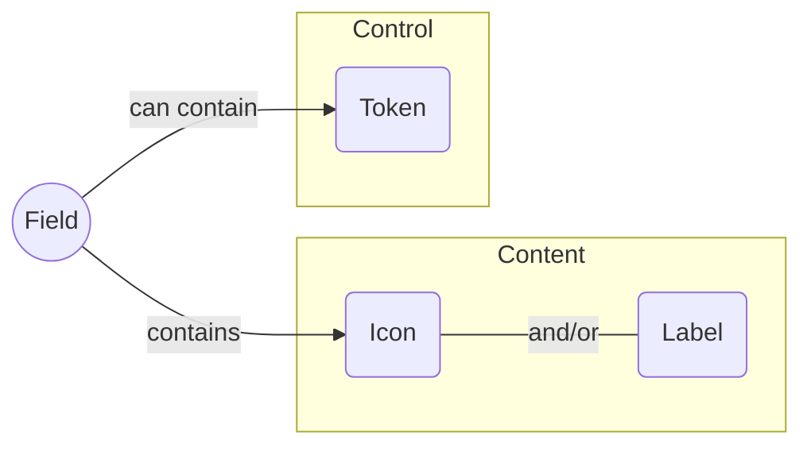

### Dropdown
field that contains a pre-populated menu of items
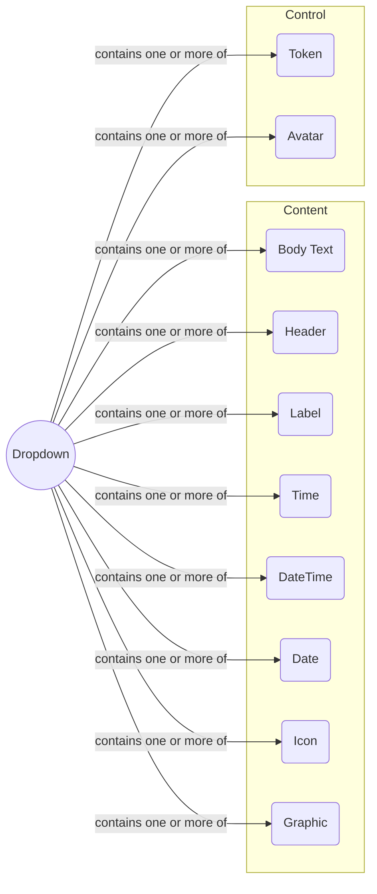

### Stepper
* a field that contains a button for incrementing or decrementing a numerical value
	```mermaid
	flowchart LR
		ST((Stepper)) -- contains --> FI(Field)
	```

## Dial
A knob that can be rotated 360 degrees for input. Can contain a field.

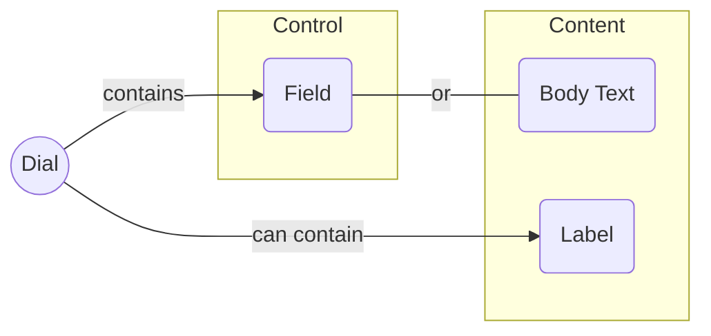

## Filmstrip
a horizontal bar that controls the playback of a video. It always contains a playhead, and buttons to play and pause a video. It can also contain thumbnails of keyframes in the video, and other buttons and labels to control aspects of playback.
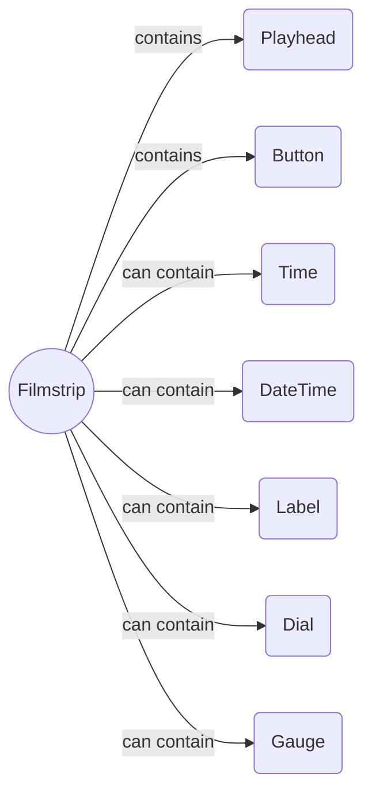

## Gauge
* a field that contains a knob that can be rotated less than 360 degrees for input
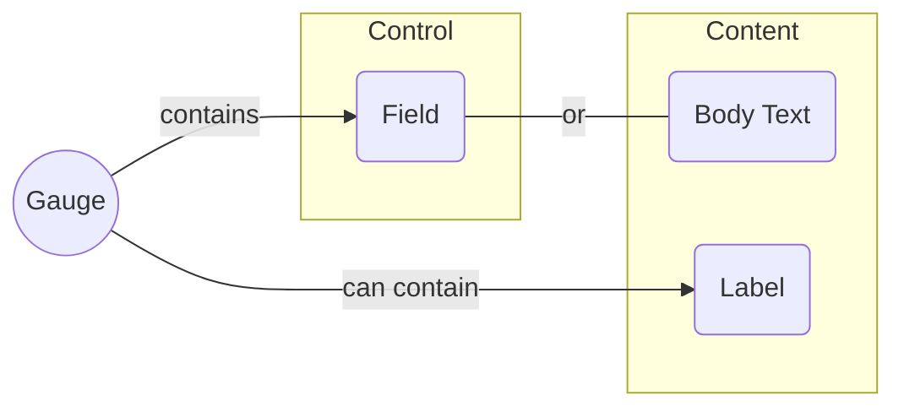
## List Header
* a field that can be used to filter or sort items in a list
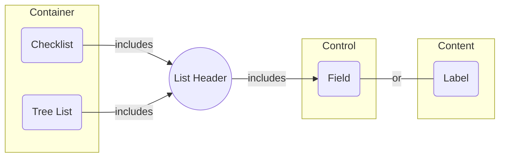
## List Handle
a floating button on the edge of a list that displays the number of items that are hidden beyond the edge. If the list is expandable, then pressing the button expands the list. Otherwise, pressing the button scrolls the list
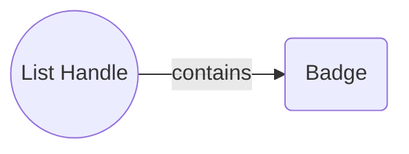
## Navigation Link
a link is a button within a navigation that takes the user to a new location
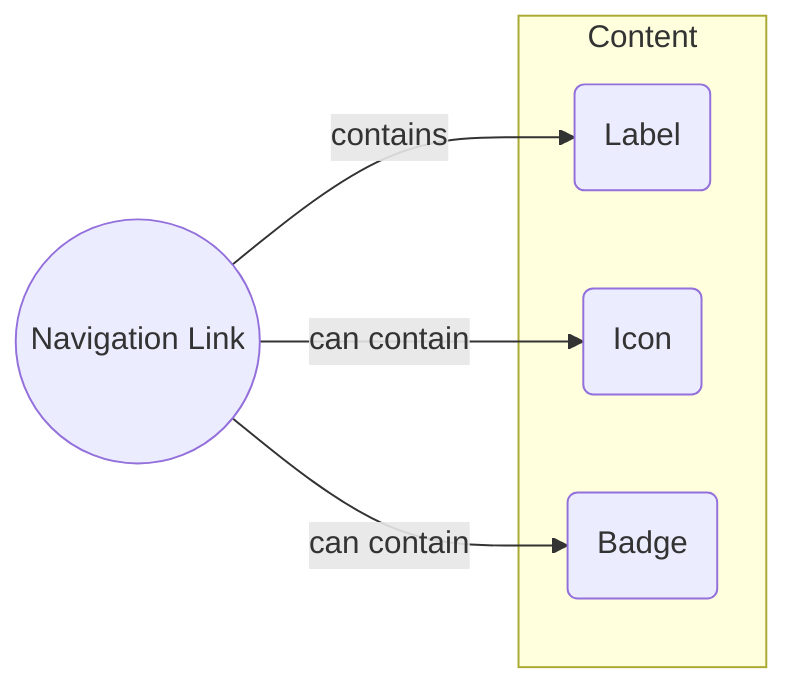
## Navigation Breadcrumb
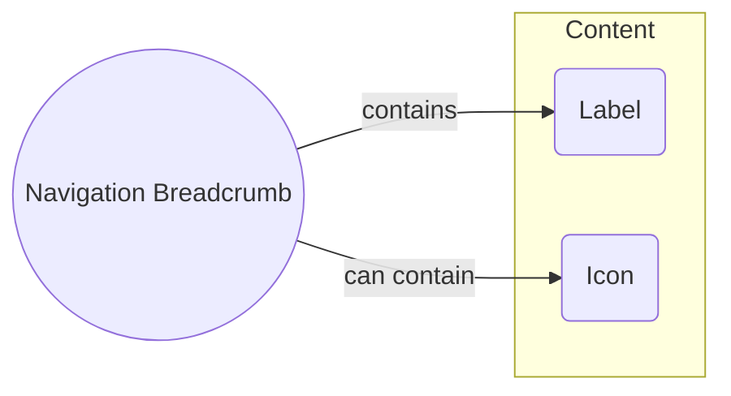
a breadcrumb is a button within a navigation that takes a user back to a previous location.
* Single-segment
* multi-segment
a multi-segment breadcrumb lets a jump back to any previous location within a navigational hierarchy
* generally, it is best practice to avoid multi-segment breadcrumbs. However, there are specific situations in which they are unavoidable

## Navigation Tabs
* also known as a [segmented control](https://developer.apple.com/design/human-interface-guidelines/components/selection-and-input/segmented-controls/)
* a toggle in which only one item can be selected. The selected item switches the contents and controls displayed within a container
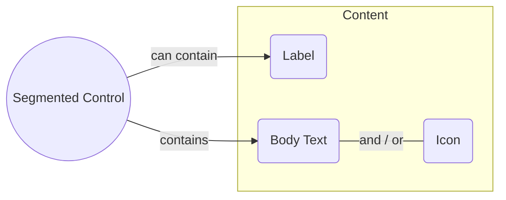

## Playhead
a vertical or horizontal line that can be repositioned along a filmstrip or graph.
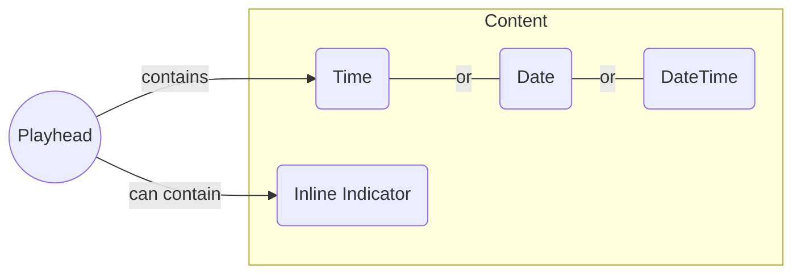
## Slider
* Horizontal
* Vertical
* Discrete
* Continuous
* Ranged
	* *a ranged slider contains two handles: one that defines a minimum value and another that defines a maximum value*
* Multi-Ranged
	* *a multi-ranged slider contains pairs of handles, where the starting handle in the pair defines a local minimum, and the ending handle defines a local maximum*
	```mermaid
	flowchart LR
		SL(Slider) -- can contain --> FL(Field) & L(Label) & I(Icon)
	subgraph Content
		L
		I
	end
	subgraph Control
		FL
	end
	```
## Socket
a connection on a node. Dragging the socket produces a line that can be dropped into another socket. The line signifies a connection between two nodes
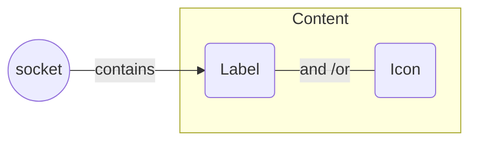
## Table Header
```mermaid
flowchart LR
	TH((Table Header)) -- contains --> F(Field) ---|or| CP(Checklist Progress Indicator) ---|or| L(Label) ---| and / or| I(Icon)
	subgraph Content
		L
		I
	end
	subgraph Control
		F
		CP
	end
```
## Timeline marker
a point along a track in a timeline
## Timeline track
a branch of a timeline. can contain  mix of timeline markers and timeline segments
## Timeline segment
a range along a track in a timeline
```mermaid
flowchart LR
  TS((Timeline Segment)) -- can contain --> L(Label) & G(Graphic) & I(Icon) & T(Token)
  subgraph Content
    L
    G
    I
  end
  subgraph Control
    T
  end
```
## Toast
```mermaid
flowchart LR
T((Toast)) -- contains --> B(Body Text)
T -- can contain --> BT(Button) & I(Icon) & L(Label) & A(Avatar)
subgraph Control
	BT
end
subgraph Content
	A
	B
	I
	L
end
```
a control that wraps content. automatically appears on the screen, and disappears after a short period of time - usually around 15 seconds. The control can be manually dismissed
## Tooltip
```mermaid
flowchart LR
	T((Tooltip)) -- contains --> L(Label)
	T -- can contain --> I(Icon) & A(Avatar) & B(Badge)
	subgraph Content
		L
		I
		B
	end
	subgraph Control
		A
	end
```
## Toggle
a button in which one or more items can remain pressed after they are released. 
### Switch
a toggle with two states that looks like an actual switch.

```mermaid
flowchart LR
	B((Button)) -- can contain --> L(Label)
	B -- contains --> BO(Body Text)
	BO ---| and / or | I(Icon)
	subgraph Content
	BO
	I
	L
	end
```
## Token
* A word or phrase that can be dragged, dropped, or deleted within or among fields
```mermaid
flowchart LR
T((Token)) -- contains --> BT(Body Text)
T -- can contain --> I(Icon)
subgraph Content
	BT
	I
end
```
## Tree List Leaf
## Tree List Branch

# Container
All containers group related content and controls together. Some containers can also contain other containers.
```mermaid
flowchart LR
PA(Panel) -- can contain --> CA(Canvas) & CH(Checklist) & GR(Graph) & NG(Node Graph) & TA(Table) & TI(Timeline) & TR(Tree List) & VP(Video Player)
NA(Navigation)
PAL(Palette)
POP(Popover)
TA -- contains --> TAB(Table Cell)
NG -- contains --> NO(Node)
```
## Canvas
%%todo: canvas as container, with bounding box, box handles as controls - need to note that a bounding box can also contain a lable or an inline label%%
## Checklist
```mermaid
flowchart LR
C((Checklist)) -- contains --> CI(Cheklist Item) & CH(Checklist Header) & CP(Checklist Progress Indicator) & LH(List Handle)
subgraph Control
	CI
	CH
	CP
	LH
end
```
## Collection
A two dimensional grid of collection items. Items in the grid can be independently selected, dragged out of one collection and dropped into another
```mermaid
flowchart LR
	C((Collection)) -- contains --> CI(Collection Item)
```
## Graph
A plot that displays values along an X and Y axis. A portion of the plot can be selected by dragging from one end of the graph to the other
```mermaid
flowchart LR
	G((Graph)) -- contains --> TL(Bar) & L(Line)
	G -- can contain --> CTI(Current Time Indicator)
```
## Navigation
A bar that contains links to different locations in an application. It can optionally contain a way to return to previous locations.
```mermaid
flowchart LR
	N((Navigation)) -- contains --> NL(Navigation Link)
	N -- can contain --> NB(Navigation Breadcrumb) & B(Button)
``` 
%%todo: add navigation and panel to containers, where a navigation is a container that can ONLY contain navigation elements, and a panel is a container that can contain any combination of elements, and can optionally be bound to the left, right or bottom of the screen, or can be free-floating within the center of the screen%%
## Node
a container that contains sockets, which allow it to connect to other nodes.
```mermaid
flowchart LR
	NO((Node)) -- contains --> SK(Socket)
	NO -- can contain --> B(Button) & TS(Toggle Switch) & SC(Segmented Control) & S(Slider) & F(Field) & ST(Stepper) & DR(Dropdown) & DI(Dial) & GA(Gauge) & CI(Checklist Item) & CP(Checklist Progress Indicator) & TLL(Tree List Leaf) & TLB(Tree List Branch) & BT(Body Text) & TI(Time) & DA(Date) & DT(DateTime) & BA(Badge) & BR(Bar) & DO(Donut) & SU(Sunburst) & LI(Line) & IC(Icon) & GR(Graphic) & CLI(Collection Item) & CLL(Collection) & GRA(Graph) & VPP(Video Player)
				subgraph Control
					B
					TS
					SC
					S
					F
					ST
					DR
					DI
					GA
					CI
					CP
					TLL
					TLB
					CLI
				end
				subgraph Content
					BT
					TI
					DA
					DT
					BA
					BR
					DO
					SU
					LI
					IC
					GR
				end
				subgraph Container
					CLL
					GRA
					VPP
				end
```
## Node Graph
A free-form canvas that can contain one or more nodes. A node is a container that has room for content, as well as one or more sockets that let it connect to other nodes
```mermaid
flowchart LR
	NDG((Node Graph)) -- contains --> NO
	NO(Node) -- contains --> SC(Socket)
	NO -- can contain --> B(Button) & TS(Toggle Switch) & SC(Segmented Control) & S(Slider) & F(Field) & ST(Stepper) & DR(Dropdown) & DI(Dial) & GA(Gauge) & CI(Checklist Item) & CP(Checklist Progress Indicator) & TLL(Tree List Leaf) & TLB(Tree List Branch) & BT(Body Text) & TI(Time) & DA(Date) & DT(DateTime) & BA(Badge) & BR(Bar) & DO(Donut) & SU(Sunburst) & LI(Line) & IC(Icon) & GR(Graphic) & CLI(Collection Item) & CLL(Collection) & GRA(Graph) & VPP(Video Player) & AV(Avatar)
				subgraph Control
					AV
					B
					TS
					SC
					S
					F
					ST
					DR
					DI
					GA
					CI
					CP
					TLL
					TLB
					CLI
				end
				subgraph Content
					BT
					TI
					DA
					DT
					BA
					BR
					DO
					SU
					LI
					IC
					GR
				end
				subgraph Container
					CLL
					GRA
					VPP
				end
```
## Palette
a group of controls that floats above all of the other interface elements on the screen. This group persists until it is manually dismissed. It is generally anchored to an edge of an application interface.
*mermaid chart of composition of palette*
## Panel
## Popover
a group of content and/or controls that appears when an interface element is pressed, and automatically disappears when any other interface element outside of it is pressed. Also known as a "modal". Popovers can optionally be converted into Palettes when they are dragged away from the element that spawned them.
## Table
```mermaid
flowchart LR
	T((Table)) -- contains --> TC(Table Cell) & TH(Table Header)
	TH -- can contain --> F(Field) & CP(Checklist Progress Indicator)
	TC((Table Cell)) -- can contain --> B(Button) & TS(Toggle Switch) & SC(Segmented Control) & S(Slider) & F(Field) & ST(Stepper) & DR(Dropdown) & DI(Dial) & GA(Gauge) & CI(Checklist Item) & CP(Checklist Progress Indicator) & TLL(Tree List Leaf) & TLB(Tree List Branch) & BT(Body Text) & TI(Time) & DA(Date) & DT(DateTime) & BA(Badge) & BR(Bar) & DO(Donut) & SU(Sunburst) & LI(Line) & IC(Icon) & GR(Graphic) & CLI(Collection Item) & CLL(Collection) & GRA(Graph) & VPP(Video Player)
	subgraph Control
		B
		TS
		SC
		S
		F
		ST
		DR
		DI
		GA
		CI
		CP
		TLL
		TLB
		CLI
	end
	subgraph Content
		BT
		TI
		DA
		DT
		BA
		BR
		DO
		SU
		LI
		IC
		GR
	end
	subgraph Container
		CLL
		GRA
		VPP
	end
```
## Table Cell
```mermaid
flowchart LR
	TC((Table Cell)) -- can contain --> B(Button) & TS(Toggle Switch) & SC(Segmented Control) & S(Slider) & F(Field) & ST(Stepper) & DR(Dropdown) & DI(Dial) & GA(Gauge) & CI(Checklist Item) & CP(Checklist Progress Indicator) & TLL(Tree List Leaf) & TLB(Tree List Branch) & BT(Body Text) & TI(Time) & DA(Date) & DT(DateTime) & BA(Badge) & BR(Bar) & DO(Donut) & SU(Sunburst) & LI(Line) & IC(Icon) & GR(Graphic) & CLI(Collection Item) & CLL(Collection) & GRA(Graph) & VPP(Video Player) & AV(Avatar)
	subgraph Control
		AV
		B
		TS
		SC
		S
		F
		ST
		DR
		DI
		GA
		CI
		CP
		TLL
		TLB
		CLI
	end
	subgraph Content
		BT
		TI
		DA
		DT
		BA
		BR
		DO
		SU
		LI
		IC
		GR
	end
	subgraph Container
		CLL
		GRA
		VPP
	end
```

## Timeline
A horizontally scrolling list of layers that includes points and regions over time. E.g. a timeline in a video editor
```mermaid
flowchart LR
	T((Timeline)) -- contains --> TT(Timeline Track) & LH(List Handle) & PH(Playhead)
  TT -- contains --> TS(Timeline Segment) & TM(Timeline Marker)
```
## Tree List
```mermaid
flowchart LR
	T((Tree List)) -- contains --> TL(Tree Leaf) & TB(Tree Branch) & LH(List Handle) & LHH(List Header)
```
## Video Player
```mermaid
flowchart LR
	VP((Video Player)) -- contains --> FS(Filmstrip) & GR(Graphic)
	FS -- contains --> PL(Playhead) & BT(Button)
	FS -- can contain --> TI(Time) & DT(DateTime) & L(Label) & DI(Dial) & GA(Gauge)
subgraph Control
	FS
	PL
	BT
	DI
	GA
end
subgraph Content
	GR
	TI
	DT
	L
end
```


| sizes | affordances |
| ----- | ----------- |
| [inline](./Styles#inline), [small](./Styles#small), [medium](./Styles#medium), [large](./Styles#large), [massive](./Styles#massive) | [hoverable](./Affordances#hoverable), [peekable](./Affordances#peekable), [pressable](./Affordances#pressable), [toggleable](./Affordances#toggleable), [slideable](./Affordances#slideable), [selectable](./Affordances#selectable), [draggable](./Affordances#draggable), [focusable](./Affordances#focusable), [editable](./Affordances#editable), [scrollable](./Affordances#scrollable) |
