# Content
## Header
## Body Text
## Label
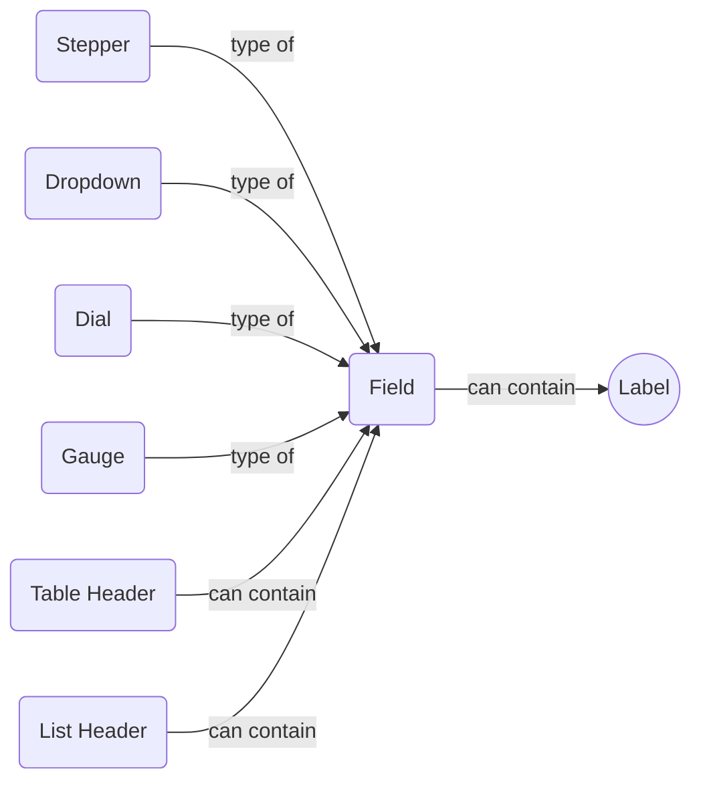
### Inline Indicator
a label that can be inlined within a field, and indicates special characteristics e.g. "required" or "warning"
### Annotation
a label that can be attached to the focus ring or border of any other component

## Time
a timestamp, which can be formatted as HH:MM, HH:MM:SS:Timezone, HH:MM:SS:MS:Timezone, or as a SMPTE frame-time
## Date
*a date, which can include Year, month and day*
## DateTime
	* *a ate and time into a single label*
## Badge
A short text, or text and icon, enclosed by a container, similar to a token. Unlike a token, a badge cannot be dragged or deleted*
## Bar
* Gauge %%todo explain that gauge is a bar that is curved into a circular arc to save horizontal space%%
## Donut
## Sunburst
%% sunburst is a kind of chart ... and it can have controls as well. shouldn't it be in containers? %%
## Line
## Icon
## Graphic
an image or video
%%is an icon a subtype of a graphic. can these two be merged?%%
# Control
## Button
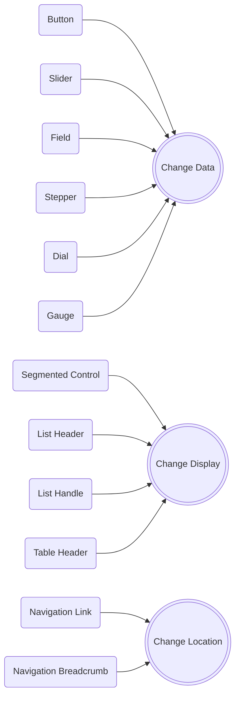
* * %%need to move this chart elsewhere, since it's not like the others%%
## Toggle Switch
## Segmented Control
## Navigation Link
a link is a button within a navigation that takes the user to a new location
## Navigation Breadcrumb
a breadcrumb is a button within a navigation that takes a user back to a previous location.
* Single-segment
* multi-segment
a multi-segment breadcrumb lets a jump back to any previous location within a navigational hierarchy
* generally, it is best practice to avoid multi-segment breadcrumbs. However, there are specific situations in which they are unavoidable
## Slider
* Horizontal
* Vertical
* Discrete
* Continuous
* Ranged
	* *a ranged slider contains two handles: one that defines a minimum value and another that defines a maximum value*
* Multi-Ranged
	* *a multi-ranged slider contains pairs of handles, where the starting handle in the pair defines a local minimum, and the ending handle defines a local maximum*
	```mermaid
	flowchart LR
		SL(Slider) -- can contain --> FL(Field)
	```
## Field
* single-segment
* multi-segment
	* *a multi-segment field groups two or more single segment fields together*
* multiline
	* *mermaid chart of field composition and inheritance here*
## Token
* A word or phrase that can be dragged, dropped, or deleted within or among fields
## Stepper
* a field that contains a button for incrementing or decrementing a numerical value
	```mermaid
	flowchart LR
		ST((Stepper)) -- contains --> FI(Field)
	```
## Dropdown
* a field that contains a pre-populated menu of items
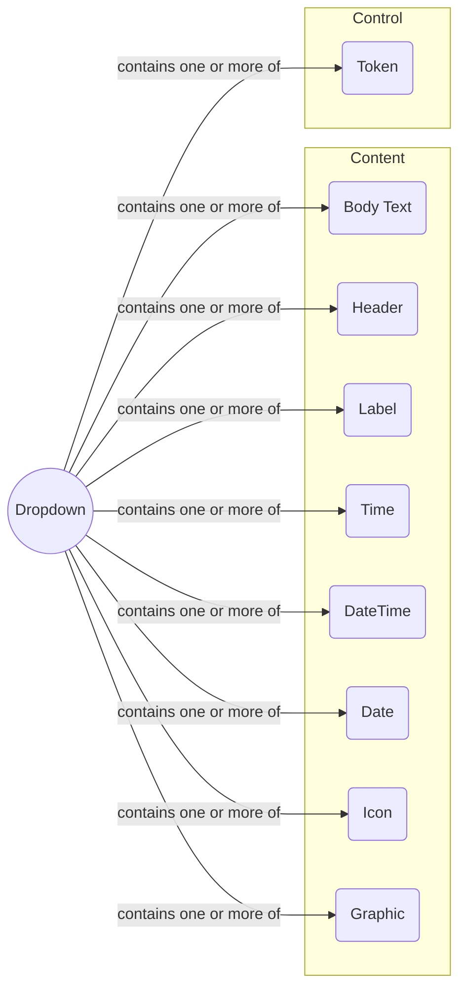
## Dial
a field that contains a knob that can be rotated 360 degrees for input
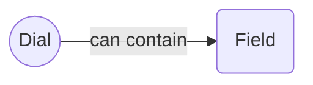
## Gauge
* a field that contains a knob that can be rotated less than 360 degrees for input
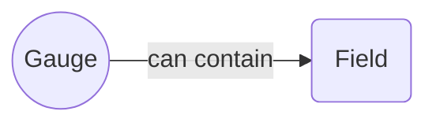
## List Header
* a field that can be used to filter or sort items in a list
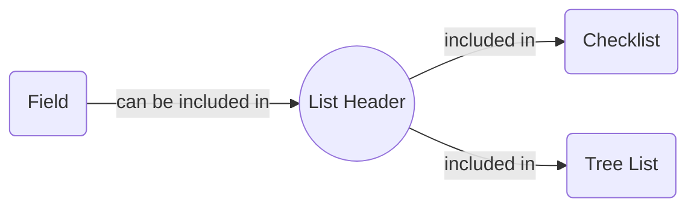
## List Handle
a floating button on the edge of a list that displays the number of items that are hidden beyond the edge. If the list is expandable, then pressing the button expands the list. Otherwise, pressing the button scrolls the list
## Checklist Item
## Checklist Progress Indicator
## Timeline marker
a point along a track in a timeline
## Timeline track
a branch of a timeline. can contain  mix of timeline markers and timeline segments
## Timeline segment
a range along a track in a timeline
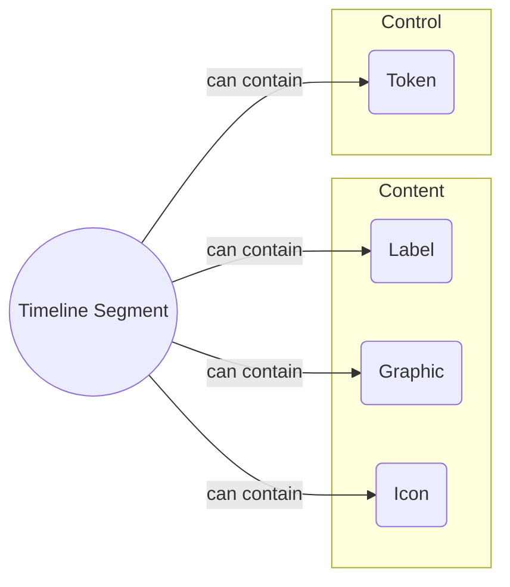
## Tree List Leaf
## Tree List Branch
## Collection Item
a tile that wraps content, making it selectable and draggable within or among collections
*mermaid chart of collection item composition*
## Table Header
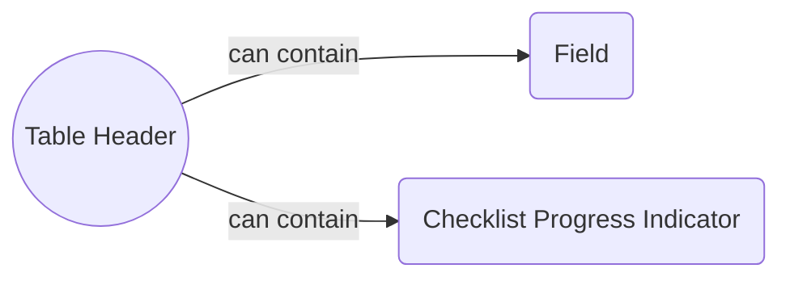
## Table Cell
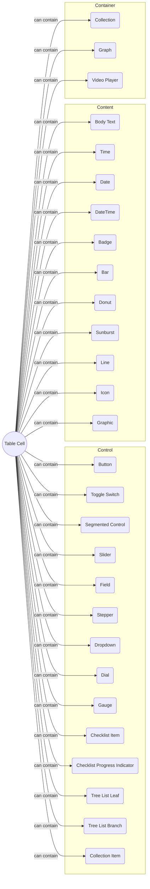
## Toast
a control that wraps content. automatically appears on the screen, and disappears after a short period of time - usually around 15 seconds. The control can be manually dismissed
## Tooltip
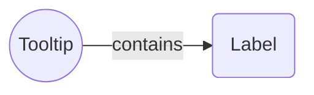
## Socket
a connection on a node. Dragging the socket produces a line that can be dropped into another socket. The line signifies a connection between two nodes
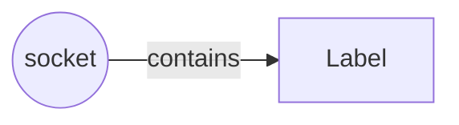
## Playhead
a vertical or horizontal line that can be repositioned along a filmstrip or graph.
## Filmstrip
a horizontal bar that controls the playback of a video. It always contains a playhead, and buttons to play and pause a video. It can also contain thumbnails of keyframes in the video, and other buttons and labels to control aspects of playback.
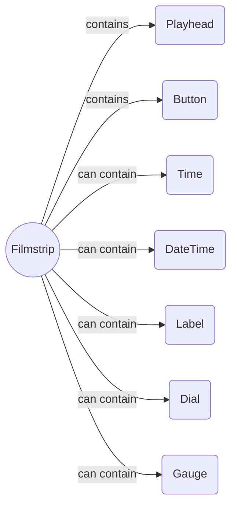

# Container
## Checklist
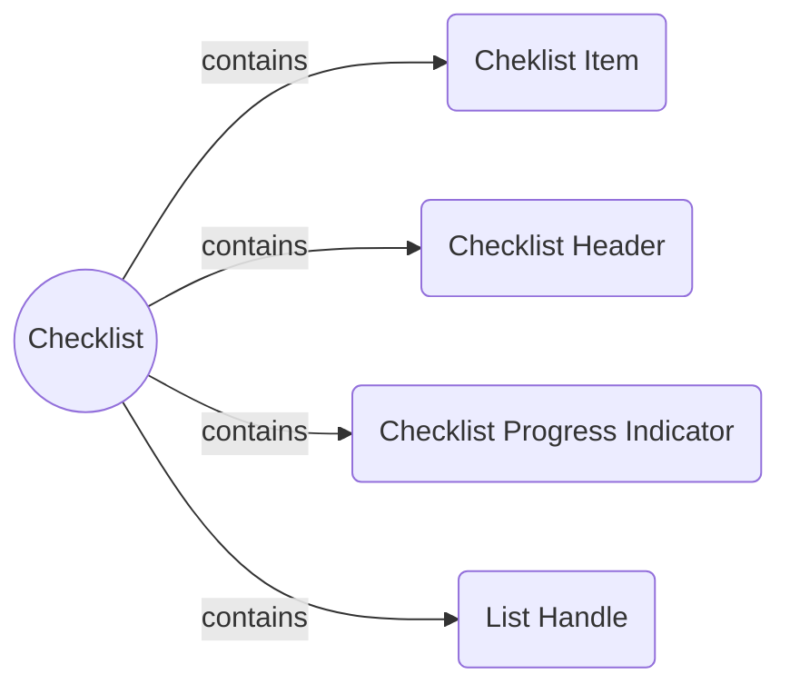
## Timeline
A horizontally scrolling list of layers that includes points and regions over time. E.g. a timeline in a video editor
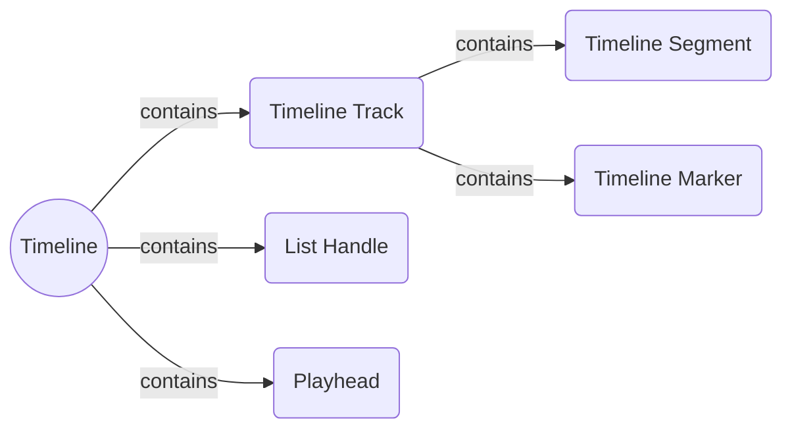
## Tree List
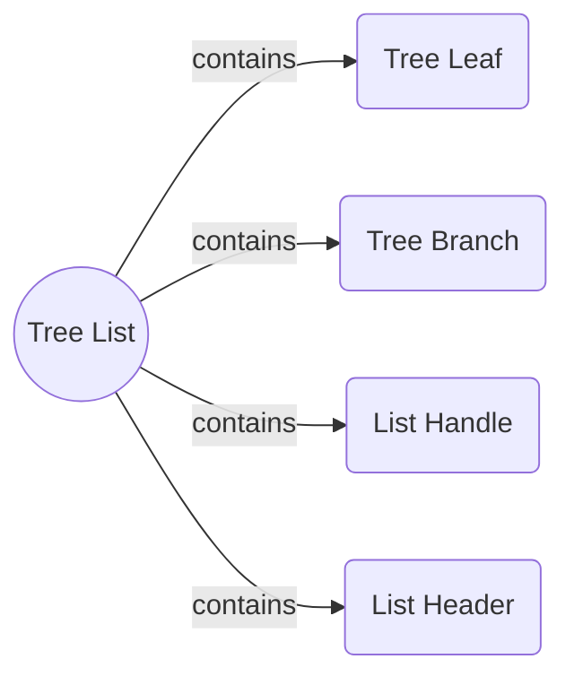
## Collection
A two dimensional grid of collection items. Items in the grid can be independently selected, dragged out of one collection and dropped into another
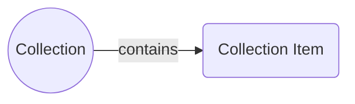
## Graph
A plot that displays values along an X and Y axis. A portion of the plot can be selected by dragging from one end of the graph to the other
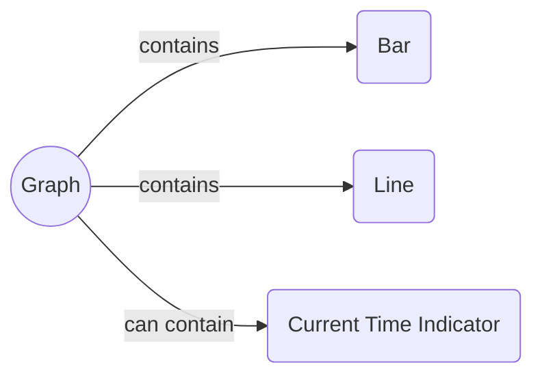
## Table
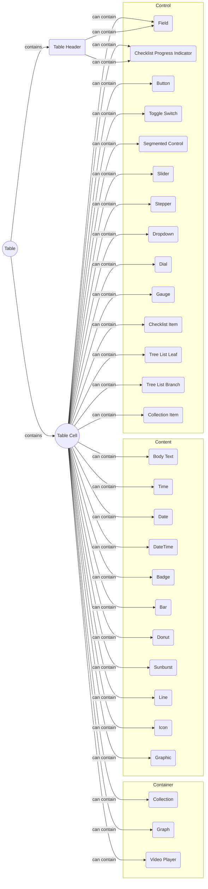
## Node
a container that contains sockets, which allow it to connect to other nodes.
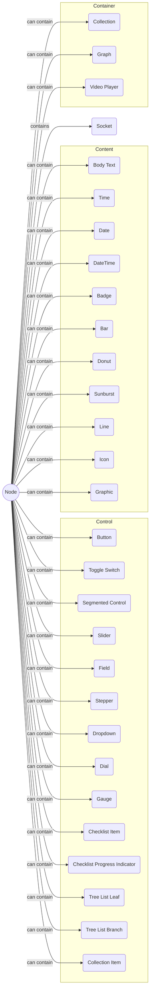
## Node Graph
A free-form canvas that can contain one or more nodes. A node is a container that has room for content, as well as one or more sockets that let it connect to other nodes
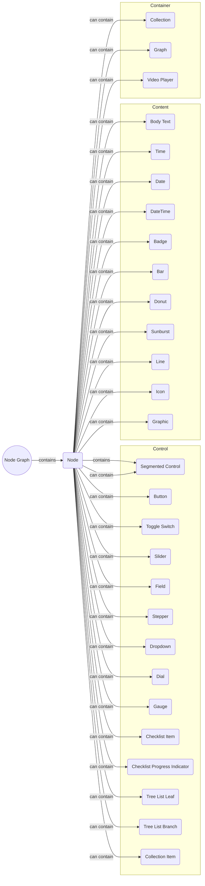
## Popover
a group of content and/or controls that appears when an interface element is pressed, and automatically disappears when any other interface element outside of it is pressed. Also known as a "modal". Popovers can optionally be converted into Palettes when they are dragged away from the element that spawned them.
## Palette
a group of controls that floats above all of the other interface elements on the screen. This group persists until it is manually dismissed. It is generally anchored to an edge of an application interface.
mermaid chart of composition of palette
## Video Player
```mermaid
flowchart LR
	VP((Video Player)) -- contains --> FS(Filmstrip) & GR(Graphic)
	FS -- contains --> PL(Playhead) & BT(Button)
	FS -- can contain --> TI(Time) & DT(DateTime) & L(Label) & DI(Dial) & GA(Gauge)
```

%%todo: canvas as container, with bounding box, box handles as controls - need to note that a bounding box can also contain a lable or an inline label%%

%%todo: rubber band select for checklist, timeline, treelist, collection, graph, node graph - where rubber band select can be discontiguous, and have handles%%
%%todo: span for aformentioned, where a span is a selection that is persisted to the container%%

%%todo: add navigation and panel to containers, where a navigation is a container that can ONLY contain navigation elements, and a panel is a container that can contain any combination of elements, and can optionally be bound to the left, right or bottom of the screen, or can be free-floating within the center of the screen%%
